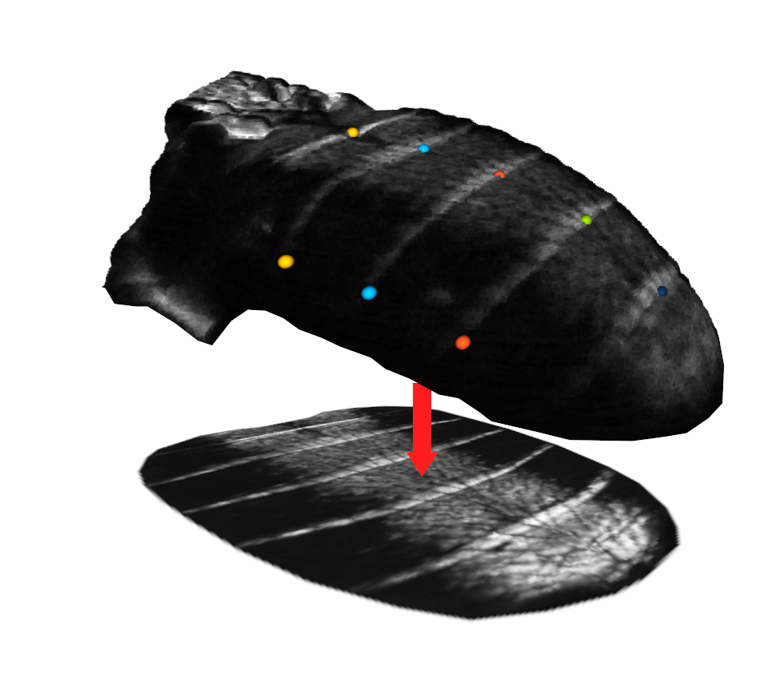

# 3D-DrosophilaRegistration

## A 3D fluorescence microscopy registration pipeline

This project offers a set of tools to register multi-channel 3-dimensional images, segment an object in the image stack, and produce a two-dimensional image of its surface. It is tailored to the registration of confocal microscopy images of drosophila and was developed to extract and analyze gene expression patterns in the epithelial cells of the drosophila abdomen. However, it can be adapted for different types of 3D imaging data. Currently, the project supports images with 3 color channels.

## Table of Contents
- [Introduction](#introduction)
- [Features](#features)
- [Installation](#installation)
- [Usage](#usage)
- [License](#license)

## Introduction

The project provides a comprehensive set of tools designed for registering multi-channel 3-dimensional images, segmenting an object within those images, register it to a reference image, and generating two-dimensional images of the surface of the segmented object. Initially developed for the registration of confocal microscopy images of drosophila, it could be adapted for other types of 3D imaging data.

## Features

- Automated object segmentation using a variable threshold
- Manual registration of segmented objects to a reference using a graphical interface and alignment to a reference
- Automated projection of object surfaces using a modified sinusoid projection and spline fitting
- Manual elastic warping of images to register them with a reference 2D image using a graphical interface
- Tools for performing principal component analysis (PCA) and visualization of registered images

## Installation

To install the project, follow these steps:

1. [Step 1]
2. [Step 2]
3. [Step 3]

Make sure you have the following dependencies installed:

- [Dependency 1]
- [Dependency 2]
- [Dependency 3]

## Usage

## License
This project is licensed under the terms of the MIT license.

