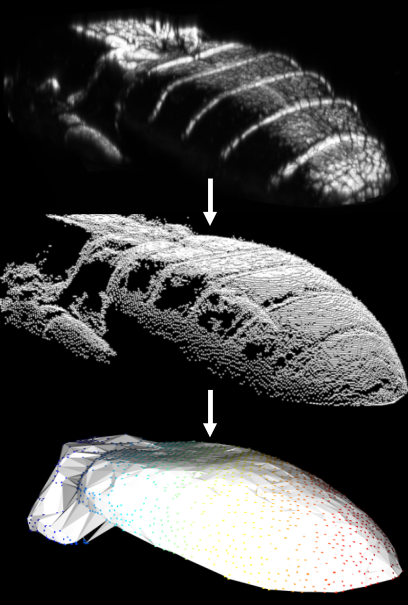
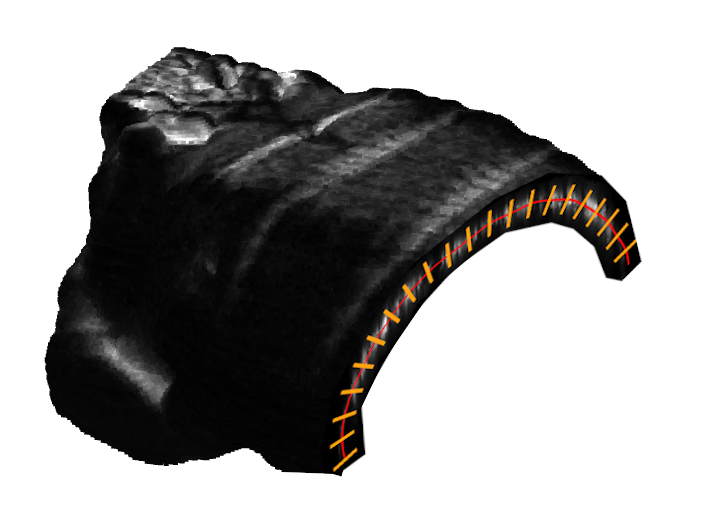
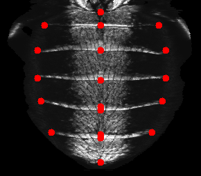

# 3D-DrosophilaRegistration

## A 3D fluorescence microscopy registration pipeline

This project offers a set of tools to register multi-channel 3-dimensional images, segment an object in the image stack, and produce a two-dimensional image of its surface. It is tailored to the registration of confocal microscopy images of drosophila and was developed to register and analyze gene expression patterns in the epithelial cells of the drosophila abdomen. However, it can be adapted for different types of 3D imaging data. Currently, the project supports images with 3 color channels.

## Table of Contents
- [Introduction](#introduction)
- [Features](#features)
- [Installation](#installation)
- [Usage](#usage)
- [Details of the registration pipeline](#details)
- [License](#license)

## Introduction

The project provides a comprehensive set of tools designed for registering multi-channel 3-dimensional images, segmenting an object within each image, register it to a reference shape, and generating a two-dimensional image of the surface of the segmented object. 
Initially developed for the registration of confocal microscopy images of drosophila, it could be adapted for other types of 3D imaging data.

## Features

- Automated object segmentation using a variable threshold
- Manual registration of segmented objects to a reference using a graphical interface and alignment to a reference
- Automated projection of object surfaces using a modified sinusoid projection and spline fitting
- Manual elastic warping of images to register them with a reference 2D image using a graphical interface
- Tools for performing principal component analysis (PCA) and visualization of registered images

## Installation

To install the project clone the repository:

```bash
git clone https://github.com/LMU-AgGompel/3D-DrosophilaRegistration.git
```

and install the required dependencies running pip in the project directory:

```bash
cd 3D-DrosophilaRegistration
pip install -r requirements.txt
```
## Usage

Follow these steps to run the registration pipeline:

1. **Set up a data folder:** containing a series of subfolders where the result of each step will be stored. The folders are 01_raw, 02_preprocessed, 03_registered, 04_projected, 05_landmarks, 06_warped, 07_masked_and_smooth.

2. **Prepare the raw data:** Save the raw data as separate .tif files for each channel in the "01_raw" subfolder. Include an Excel file with columns for image file name, type, and quality.

3. **Prepare the mask and reference image stack:** Use the "Test segmentation" notebook to explore the effect of the parameters of the segmentation algorithm and to save the segmented region of a specific image as a reference for registration.

4. **Prepare the model 2D image:** Elastic warping requires a reference 2D image and a CSV file containing landmark positions in the target image. See the example in the test_data folder.

5. **Run the pipeline using the 0_Run_full_pipeline notebook:**
   - Run the "Preprocessing" step for automated segmentation and cleanup of the image stack.
   - Run the "Registration" step to interactively register the image stack by selecting corresponding points.
   - Run the "Projection" step to automatically project the registered object surfaces into 2D images.
   - Run the "Labeling and Elastic Warping" step to start a graphical interface for manual labeling and elastic warping of bidimensional images.
   - Run the "Smoothing and Masking" notebook to apply a global binary mask and Gaussian smoothing.

6. **Visualize registered images and perform statistical analysis:** Use the "1_Visualization_and_Statistical_Analysis" notebook for visualizing the averages of registered images and conducting a principal component analysis of the entire dataset.

## Details of the registration pipeline


The registration pipeline consists of the following steps:

1. **Preprocessing:** Automated segmentation is performed on the image stack using an automatically determined threshold such that the segmented volume covers a fraction of the entire image volume that falls in a specified range. The segmented object is cleaned up using morphological transformations and mesh fitting to fill holes.

2. **Registration:**  The segmented volume is rendered in an interactive interface where corresponding points on the source and reference objects are selected. The image stack is then rigidly rotated and rescaled to minimize distances between the selected points.


3. **Projection:**   The surface of the registered objects is automatically projected into 2D images using a modified sinusoidal projection. The object is processed in slices, for each slice the profile of the bright object is interpolated with a spline curve and the image brightness is read out along the curve, taking the local maxima along the local normal direction. The 1D brightness profile obtained from each image slice forms one row of the 2D projected image. The various profiles obtained slicing the stack are aligned to each other at a predefined meridian plane.

4. **Labeling and Elastic Warping:**  A graphical interface built with the PYSimpleGUI library allows manual labeling and registration of bidimensional images. User-selected points are used to elastically warp the images onto a reference model using thin-plate spline registration.

## License
This project is licensed under the terms of the MIT license.

